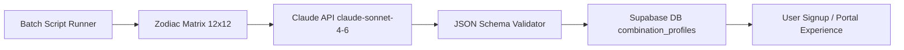

# Requirements

### Overview & Goals
Batch-generate high-quality, editorial-grade astrological content for all 144 Sun/Moon combinations (12 Sun signs $\times$ 12 Moon signs) using the Claude API (`claude-sonnet-4-6`). The generated profiles will be saved directly into the `combination_profiles` table in Supabase project `ggrhuhwxbwrfbbcwcrmv`, serving personalized synthesis, core behavioral archetypes, shadow dynamics, and blueprint upgrade teasers immediately upon user signup and profile inspection.

---

### Scope
- **In Scope:**
  - Dedicated executable script (`scripts/batch-generate-combinations.ts`) with npm command (`npm run generate:combinations`).
  - Integration with the Anthropic Messages API using model `claude-sonnet-4-6`.
  - Master system & user prompt tailored for Moonday Live brand voice, elemental synergy, and psychological depth.
  - Strict JSON response validation for all required fields: `combination_title`, `solar_essence`, `lunar_essence`, `combination_synthesis`, `default_behaviors` (array of 5 strings), `shadow_pattern`, `upgrade_teaser`.
  - Sequential loop across all 144 combinations with rate-limit delays (e.g., 750ms–1000ms) and retry backoff on API rate limits.
  - Upserting directly into `public.combination_profiles` with `onConflict: 'sun_sign,moon_sign'`.
  - Resume capability (`--skip-existing`) so interrupted runs pick up where they left off.
  - Service layer alignment in `src/services/combinationService.ts` and unit test verification.
- **Out of Scope:**
  - Changes to public marketing pages or auth gates.
  - Calling Make.com or social media distribution channels (isolated strictly to `combination_profiles`).

---

### User Stories
- **As a newly registered user**, I want to see a deeply resonant, rich synthesis of my Sun and Moon sign combination as soon as I enter my birth date, so that I experience immediate personalized value.
- **As an application operator/admin**, I want all 144 combinations pre-seeded in the database so lookups are instantaneous (sub-millisecond) without incurring runtime AI latency or cost during user onboarding.

---

### Functional Requirements
1. **144-Pair Matrix Traversal**:
   - Iterate through all 12 Sun signs $\times$ 12 Moon signs in predictable order (Aries $\rightarrow$ Pisces).
2. **Claude API Prompt Execution**:
   - Send requests to `https://api.anthropic.com/v1/messages` using `model: 'claude-sonnet-4-6'`.
   - Pass `sun_sign`, `moon_sign`, and contextual astrological data (elements, rulers, polarity).
3. **Structured JSON Output**:
   - Ensure response contains valid JSON with:
     - `combination_title`: text (e.g., "Scorpio Sun • Aries Moon — The Primal Transformer")
     - `solar_essence`: text (outward drive, conscious identity, core purpose)
     - `lunar_essence`: text (instinctive needs, emotional processing, inner sanctuary)
     - `combination_synthesis`: text (multi-paragraph harmonious integration and dynamic tension)
     - `default_behaviors`: array of 5 concrete behavioral strings
     - `shadow_pattern`: text (specific stress responses and recovery remedies)
     - `upgrade_teaser`: text (invitation to explore Sovereign daily blueprint transits)
4. **Database Upsert**:
   - Upsert into `public.combination_profiles` stamping `generated_at = now()` and `updated_at = now()`.
5. **Rate Limiting & Resiliency**:
   - Sequential pacing delay between calls.
   - Exponential backoff retry handler on HTTP 429 or network timeouts.
   - Check if record already exists and has AI content when `--skip-existing` flag is passed.

---

### Non-Functional Requirements
- **Performance**: Batch script completes within 4–8 minutes across all 144 combinations without rate-limit throttling.
- **Reliability**: 100% success rate with zero missing fields or malformed JSON in `combination_profiles`.
- **Maintainability**: Clear CLI logging showing current index `[XX/144]`, sign pair, duration, and status.

# Technical Design

### Current Implementation
- `src/services/combinationService.ts` currently provides `generateDefaultCombinationProfile(sunSign, moonSign)` as a local programmatic fallback and `fetchCombinationProfile(sunSign, moonSign)` which queries `public.combination_profiles`.
- `supabase/migrations/005_combination_profiles.sql` defines the `combination_profiles` table schema with a composite unique constraint `uq_combination_sun_moon (sun_sign, moon_sign)` and performance index `idx_combination_profiles_lookup`.
- User signup in `src/contexts/AuthContext.tsx` and `src/pages/Portal.tsx` calculates Sun and Moon signs via ephemeris and reads combination profiles seamlessly.

---

### Key Decisions
1. **Direct Node/TypeScript Script Execution vs Edge Function**:
   - *Chosen Approach*: Implement a standalone script `scripts/batch-generate-combinations.ts` executable via `npx tsx scripts/batch-generate-combinations.ts` (or `npm run generate:combinations`).
   - *Rationale*: Generating 144 profiles sequentially takes ~4–6 minutes, exceeding Supabase Edge Function HTTP execution timeouts (60–150s). A local script allows direct execution, live CLI progress, resume capabilities, and secure API key consumption from `.env` / `.env.local`.

2. **Native HTTP Fetch to Anthropic API (`claude-sonnet-4-6`)**:
   - *Chosen Approach*: Use standard Node.js `fetch` with `https://api.anthropic.com/v1/messages` and `anthropic-version: 2023-06-01`.
   - *Rationale*: Eliminates unnecessary runtime bundle dependencies while providing full control over headers, temperature, system prompts, JSON parsing, and retry handling.

3. **Rate Limiting & Backoff Strategy**:
   - *Chosen Approach*: 750ms delay between calls, with a maximum of 3 retries using exponential backoff (2s, 4s, 8s) if a 429 or 5xx status is encountered.

---

### Architecture Diagram



---

### Master Prompt & Payload Schema

#### System Prompt:
```
You are the master astrological synthesis engine for Moonday Live — an editorial luxury astrology platform.
Voice & Cadence Rules:
- Sophisticated, psychologically penetrating, grounded, and free of generic AI clichés.
- Tone is perceptive, warm, and empowering, bridging traditional Hellenistic astrological principles with modern psychological integration.
- Strictly output a valid JSON object matching the requested schema with no surrounding Markdown code fences or extra text.
```

#### User Prompt Variables:
- `sun_sign`: string (e.g. "Scorpio")
- `moon_sign`: string (e.g. "Aries")
- `sun_element`, `moon_element`, `sun_ruler`, `moon_ruler`

#### Expected JSON Output Contract:
```json
{
  "combination_title": "Scorpio Sun • Aries Moon — The Primal Catalyst",
  "solar_essence": "Outward Expression: Driven by...",
  "lunar_essence": "Inner Sanctuary: Instinctually anchored in...",
  "combination_synthesis": "Full 2-3 paragraph deep-dive synthesis...",
  "default_behaviors": [
    "Behavior 1",
    "Behavior 2",
    "Behavior 3",
    "Behavior 4",
    "Behavior 5"
  ],
  "shadow_pattern": "Specific shadow dynamic under stress and actionable pathway back to equilibrium...",
  "upgrade_teaser": "Unlock personalized transits tuned to your Scorpio/Aries blueprint..."
}
```

---

### Proposed Changes & File Structure

| File | Purpose | Action |
| :--- | :--- | :--- |
| `scripts/batch-generate-combinations.ts` | Complete batch generator with Claude API client, pacing, retry loop, and Supabase upserts | **Create** |
| `package.json` | Add `generate:combinations` script alias | **Update** |
| `src/services/combinationService.ts` | Ensure query helpers and types handle full 5-behavior array structure | **Update** |
| `src/test/combinationProfiles.test.ts` | Add test coverage for batch generator helpers and JSON validation | **Update** |

---

### Risks & Mitigations
- **API Rate Limits / Quotas**: Handled with 750ms pacing between requests, 3-tier exponential backoff, and `--skip-existing` support to safely resume.
- **Malformed JSON Output**: Handled by striping Markdown blocks (` ```json `), regex JSON extraction, and strict validation against fallback template if parsing fails.

# Validation & Verification

### Validation Approach
Verification will be conducted in three layers:
1. **Unit & Integration Tests**: Automated Vitest test suites verifying payload generation, JSON schema validation, and database upsert mappings.
2. **Batch Script Dry-Run / Test Mode**: Support for `--limit=1` or `--dry-run` to test the Claude API call and response parsing for 1 combination before running the full 144 batch.
3. **Database Inspection & Record Count**: Direct SQL verification confirming 144 unique rows in `public.combination_profiles` with valid `default_behaviors` JSON arrays of length 5.

---

### Key Scenarios & Test Checklist
- [ ] **Claude API Authentication**: Verify `ANTHROPIC_API_KEY` is loaded and accepted by `claude-sonnet-4-6`.
- [ ] **JSON Contract Integrity**: Ensure all 144 generated responses parse into the exact TypeScript `CombinationProfile` interface.
- [ ] **Array Length Validation**: Confirm `default_behaviors` contains exactly 5 strings per combination.
- [ ] **Database Constraint Compliance**: Confirm all 144 rows upsert cleanly without violating `uq_combination_sun_moon`.
- [ ] **Pacing & Retry Recovery**: Verify the script gracefully recovers from intermittent network hiccups or rate limits.
- [ ] **Build & Test Suite**: Run `npm run test` and `npm run build` to confirm zero regressions across the codebase.

# Delivery Steps

### ✓ Step 1: Create Batch Generation Script Foundation & Claude API Client
The batch generation script foundation is created with Claude API client integration, rate-limit pacing, resume capability, and schema validation.

- Create `scripts/batch-generate-combinations.ts` implementing the Anthropic Claude API client using `model: 'claude-sonnet-4-6'`.
- Implement environment variable loading for `ANTHROPIC_API_KEY`, `VITE_SUPABASE_URL`, and `SUPABASE_SERVICE_ROLE_KEY` / `VITE_SUPABASE_ANON_KEY`.
- Build the 12 $\times$ 12 matrix loop across all zodiac signs (`Aries`, `Taurus`, `Gemini`, `Cancer`, `Leo`, `Virgo`, `Libra`, `Scorpio`, `Sagittarius`, `Capricorn`, `Aquarius`, `Pisces`).
- Implement sequential execution with configurable inter-request delay (750ms default) and automatic exponential backoff retries on HTTP 429/500 errors.
- Add resume/skip functionality (`--skip-existing` flag) that checks if a combination already has Claude-generated content in `combination_profiles`.

### ✓ Step 2: Implement Master Prompt & JSON Response Parser
The master prompt produces rich, editorial-grade JSON responses adhering to the Moonday Live voice guidelines and database schema.

- Define the master generation prompt in `scripts/batch-generate-combinations.ts` embedding brand voice constraints (warm, luxury editorial, human cadence, no AI clichés, grounded in traditional elemental dynamics).
- Enforce strict JSON output structure: `combination_title`, `solar_essence`, `lunar_essence`, `combination_synthesis`, `default_behaviors` (array of exactly 5 strings), `shadow_pattern`, and `upgrade_teaser`.
- Implement JSON extraction, schema validation, and fallback sanitization (e.g. handling markdown code fences or trailing commas).

### ✓ Step 3: Integrate Database Persistence & Service Layer Alignment
Generated profiles are persisted to Supabase and query helpers in combinationService.ts are aligned.

- Implement batch upsert logic into `public.combination_profiles` using `onConflict: 'sun_sign,moon_sign'` to update existing records or insert new ones.
- Update `src/services/combinationService.ts` to ensure compatibility with 5-item `default_behaviors` string arrays and rich synthesis narratives.
- Add an npm script shortcut in `package.json` (e.g. `npm run generate:combinations`) for execution and re-runs.

### ✓ Step 4: Execute Batch Generation, Database Verification & Test Coverage
The generation pipeline is executed, all 144 profiles are verified in Supabase, and unit tests confirm schema conformance.

- Add unit test coverage in `src/test/combinationProfiles.test.ts` validating prompt structure, JSON schema compliance, and upsert payload mappings.
- Execute the script across all 144 combinations, logging live progress `[XX/144]` with elapsed time and status indicators.
- Run verification queries against `combination_profiles` confirming 144 complete rows with non-null synthesis, 5 behaviors, and proper timestamps.
- Validate the build and test suites with `npm run test` and `npm run build`.